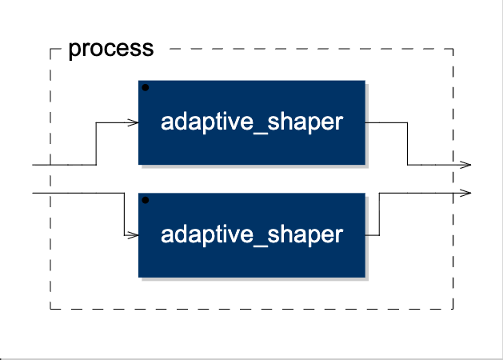

# Adaptive Clipper
**Developed by:** [axiomrasa](https://github.com/axiomrasa)  
**DSP Core:** Faust DSP (64-bit Double Precision)  
**Architecture:** Zero-Latency Dynamic Wave-Shaper / Nonlinear Processor  

---

## 🧠 Context & Industry Inspiration
This project does not attempt to reinvent the wheel. Deep harmonic processors and dynamic clippers like **FabFilter Saturn 2**, **Sonnox Oxford Inflator**, or **Kazrog K-Clip** have long proven that dynamic, level-dependent nonlinear processing is mathematically superior to static distortion. 

The goal of **Adaptive Clipper** is to strip away multiband complexity and heavy lookahead latency, isolating this industry-proven dynamic morphing logic into its purest, most lightweight, **zero-latency open-source micro-utility** form.

---

## 🔴 The Problem: Static Blindness
Standard digital waveshapers apply a fixed mathematical curve (such as $\tanh$) across the entire dynamic timeline. This "blind" approach causes severe transient degradation on percussive signals (like drums). When a sharp attack hits a static curve, the initial transient is flattened, robbing the sound of its punch, destroying the dynamic range, and pushing the instrument back in the mix.

## 🟢 The Solution: Adaptive DSP
This micro-utility resolves transient flattening by decoupling the input signal into an asynchronous analysis sidechain and a sample-accurate processing path:

1. **Envelope Tracking:** A 50ms smoothed envelope follower (`si.smooth` combined with `ba.tau2pole`) continuously evaluates the absolute time-domain energy profile of the incoming audio.
2. **Dynamic Morphing (`select2`):**
   * **Below Threshold:** Applies a smooth hyperbolic tangent curve ($\tanh$) to introduce warm, cohesive analog-style even and odd harmonics to low-level signals.
   * **Above Threshold:** Instantly morphs into a hard-clipping brickwall ceiling using optimized native `min`/`max` primitives. This preserves the structural transient snap and bite without introducing parametric phase lag or group delay.

---

## 🎛️ Architecture & Mathematical Signal Flow

The core waveshaping block switches behaviors contextually based on the sidechain analysis input:

$$y(t) = \begin{cases} \tanh(x(t) \cdot \text{drive}), & \text{if } e(t) \le \text{threshold} \\ \max(-\text{threshold}, \min(\text{threshold}, x(t) \cdot \text{drive})), & \text{if } e(t) > \text{threshold} \end{cases}$$

Where $e(t)$ represents the smoothed macroeconomic envelope tracking estimation.

### DSP Routing Blueprint


### Native UI Preview


---

## 📁 Project Directory Structure
```text
├── src/                  # Core Faust source file (adaptive_clipper.dsp)
├── juce-project/         # Generated C++ sources and Projucer project (.jucer)
├── docs/                 # Technical flowcharts and interface previews
└── builds/               # Pre-compiled binary deployment targets
    ├── Mac-VST/          # macOS legacy VST execution component
    ├── Win-VST/          # Windows VST execution component (.dll)
    └── Linux-VST/        # Linux VST execution component (.so)
💻 Hardware & DAW Compatibility MatrixTo understand how pre-compiled binaries run on your specific workstation configuration, please refer to the deployment matrix below:Hardware ArchitectureOS VersionNative SupportExecution ModeWindows (x64 / AMD64)Windows 10 / 11Yes (100%)Plug-and-Play (.dll target)Linux (x64)Ubuntu / Debian / etc.Yes (100%)Plug-and-Play (.so target)Intel Core (Legacy Mac)macOS Mojave to Monterey+Yes (100%)Plug-and-Play (Native)Apple Silicon (M1-M4 Mac)macOS Big Sur to Sequoia+Via WrapperRequires Rosetta 2 DAW Launch🛠️ Note for Apple Silicon Power Users: The pre-compiled legacy macOS binary requires running your DAW in Rosetta 2 mode. For absolute ARM64 hardware-native execution (Native VST3 or Audio Unit) without running translation layers, simply open the provided C++ project inside /juce-project using Xcode on your local machine and execute a hardware-native compile command.📊 Technical SpecificationsLatency: 0 samples (True zero-latency, production and live-tracking safe).Processing Precision: 64-bit double-precision floating-point core calculations.CPU Footprint: Ultra-lightweight (< 0.4% processing budget on modern architectures).Channel Configuration: 2-In / 2-Out Discrete Asynchronous Stereo.📄 LicenseThis project is open-source and available under the MIT License.